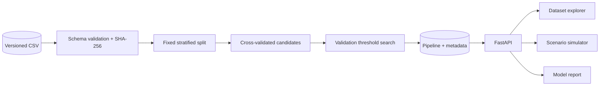

# CreditWise — Loan Approval ML System

[](https://github.com/Szaman07/CSE445-Loan-Approval/actions/workflows/ci.yml)


CreditWise is an end-to-end machine learning case study that turns a 10,000-row loan dataset into a reproducible training pipeline, an analysis API, and an interactive decision simulator. The project emphasizes honest evaluation: preprocessing stays inside the pipeline, the decision threshold is selected on validation data, and the held-out test set is used only for the final report.


## Results

| Held-out test metric | Score |
|---|---:|
| **F1** | **0.6844** |
| Recall | 0.8753 |
| Precision | 0.5619 |
| Average precision | 0.6865 |
| ROC AUC | 0.7852 |

The deployed candidate is a class-balanced L1 logistic regression with a validation-selected threshold of `0.447`. Its output is an **uncalibrated model score** for the observed approval label, not a repayment probability or real underwriting recommendation.

## What makes this project complete

- **Reproducible ML:** deterministic 60/20/20 stratified split, dataset fingerprint, saved feature order, model version, runtime metadata, and complete scikit-learn pipeline.
- **Leakage-safe selection:** 40 candidates compared with identical cross-validation folds; threshold tuning occurs on validation data, away from the test labels.
- **Purpose-built data explorer:** searchable schema, redacted row preview, distributions, numeric relationships, categorical group rates, cohort filters, and missingness auditing.
- **Scenario simulator:** all 15 deployed inputs, baseline-versus-scenario scoring, changed-field tracking, score movement, and threshold-crossing detection.
- **Production-shaped delivery:** typed FastAPI contracts, lazy-loaded React routes, responsive and keyboard-accessible UI, Docker deployment, and CI for Python and TypeScript.
- **Responsible scope:** protected attributes are excluded from the public inference policy, limitations travel with the metrics, and charts state their cohorts and denominators.

## System design



The browser never reproduces preprocessing. It sends typed requests to FastAPI, which loads the complete saved pipeline and returns the score, stored threshold, label, model version, and input-handling notes.

## Repository structure

```text
creditwise/
├── api/                    # FastAPI routes and public contracts
├── data/                   # Versioned source dataset
├── docs/                   # Architecture, model card, experiments
├── src/creditwise/         # Data, features, training, inference, exploration
├── tests/                  # API, data, feature, and integration tests
├── web/                    # React + TypeScript application
├── Dockerfile              # Reproducible API image
└── render.yaml             # Backend deployment blueprint
```

## Run locally

Requirements: Python 3.11 or 3.12 and Node.js 20+.

```powershell
python -m venv .venv
.venv\Scripts\python.exe -m pip install -e ".[dev]"
.venv\Scripts\python.exe -m creditwise.training
.venv\Scripts\python.exe -m uvicorn api.main:app --reload
```

In a second terminal:

```powershell
cd web
npm ci
npm run dev
```

Open `http://127.0.0.1:5173`. The API runs at `http://127.0.0.1:8000`, with interactive OpenAPI documentation at `http://127.0.0.1:8000/docs`.

## Quality checks

```powershell
.venv\Scripts\python.exe -m pytest -q
.venv\Scripts\python.exe -m ruff check .
cd web
npm run lint
npm test
npm run build
```

## Deployment

The repository is ready for a split deployment:

1. Deploy the root project with the included Render blueprint.
2. Deploy `web/` as a Vercel project.
3. Set `VITE_API_BASE_URL` in Vercel to the Render service URL.
4. Set `CORS_ORIGINS` in Render to the exact Vercel production domain.

## Documentation

- [Architecture](docs/ARCHITECTURE.md)
- [Model card](docs/MODEL_CARD.md)
- [Experiment record](docs/EXPERIMENTS.md)

## Responsible use

This is an educational portfolio system trained on a course-provided dataset. Dataset provenance, currency, income period, collection process, population coverage, consent, and license require confirmation before reuse. Excluding selected sensitive fields does not establish fairness or regulatory compliance; proxy effects and subgroup disparities may remain.

## License

Code is released under the [MIT License](LICENSE). The dataset is included for academic reproducibility and retains its original, presently undocumented licensing status.
