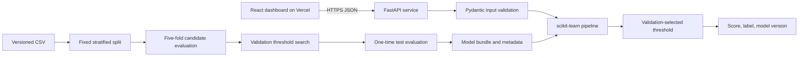

# Architecture

The training boundary is deliberately separate from serving. `creditwise.training` validates and fingerprints the CSV, creates one deterministic 60/20/20 stratified split, compares candidates by cross-validated training F1, selects a threshold on validation probabilities, and evaluates the frozen choice once on the test set. The serialized bundle contains the entire preprocessing pipeline, feature order, threshold, and metadata.

The browser never reimplements preprocessing. It submits a typed applicant record to FastAPI and receives a model score, threshold-based label, model version, and notes about missing values handled by the pipeline.

For deployment, Vercel serves the static React build and Render builds the Python container. The Docker image trains from the repository's fingerprinted dataset during the image build, making the model artifact reproducible from source.
